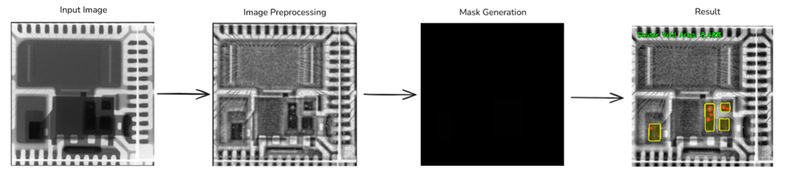
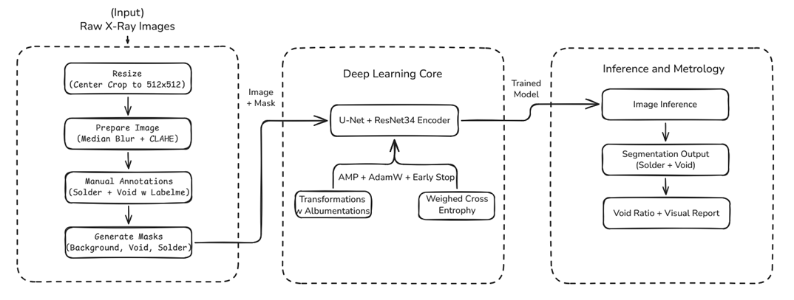
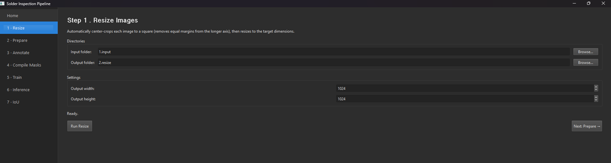

# Solder Void Detection for PQFN X-ray Images

<p align="center"><b>Trained model weights:</b> <a href="https://huggingface.co/wesleytaetae/soldervoid-detection">https://huggingface.co/wesleytaetae/soldervoid-detection</a></p>



This project showcases a trained deep learning segmentation model for solder void detection in PQFN X-ray images. In semiconductor packaging, a **PQFN (Power Quad Flat No-Lead)** device is a surface-mount integrated circuit package where solder joints sit underneath the package body, making **X-ray inspection** important for non-destructive quality control. The core model is a U-Net with a ResNet34 encoder, trained to segment `background`, `solder`, and `void` regions from grayscale industrial X-rays and turn those predictions into measurable void ratios for inspection use.

The emphasis of this repository is the model itself: how the data was prepared, how the network was trained, and how the final predictions are converted into production-style visual and metrology outputs. On 5 unseen test images, the model achieved a mean `Solder IoU` of `0.8541` and a mean `Void IoU` of `0.7496`, showing solid generalization on a small-target defect segmentation problem.

Also included in this repository is a desktop UI built with PySide6 to streamline the full workflow, including image resizing, preprocessing, LabelMe-assisted annotation prep, mask compilation, training, inference visualization, and IoU evaluation.

---

## Project Architecture Overview

**Pipeline**





---

## Dataset

The dataset used for this project consists of **30 X-ray images** of a **PQFN semiconductor package from the same device model**. Each image captures the solder joint region beneath the package, where **solder voids**, **joint coverage**, and overall **package-attach quality** are inspected during semiconductor manufacturing.

Each image was manually annotated to separate:

- `Background`
- `Solder`
- `Void`

This makes the project a focused, single-device segmentation study rather than a broad multi-package benchmark. The dataset is intentionally small and specialized, which makes the training setup, augmentation strategy, and defect-focused evaluation especially important for achieving useful generalization in an electronics manufacturing / semiconductor inspection setting.

### Semiconductor Context

- **Package**: The physical housing of the chip, including the external connection structure used for board assembly.
- **PQFN**: A no-lead power package where the solder joints are mostly hidden underneath the component.
- **Solder joint**: The conductive attachment between the semiconductor package and the PCB or leadframe landing area.
- **Void**: An air pocket or gap inside the solder region that can weaken thermal or mechanical reliability.
- **X-ray inspection**: A standard non-destructive inspection method used when solder features are hidden from normal optical view.

---

## 1) Data Engineering Layer

**Contrast Optimization (CLAHE)**
Raw X-rays are noisy and low-contrast. CLAHE amplifies local gradients to reveal sub-pixel air bubbles for both humans and the model.

**Vector Rasterization**
LabelMe JSON vectors are compiled into integer PNG masks using the Painter's Algorithm with strict class order:
- 0: Background
- 1: Solid Solder
- 2: Void

**Synchronized Augmentation**
Albumentations applies synchronized transforms to ensure the same spatial matrix is applied to image and mask (rotations, flips, crops).

---

## 2) Deep Learning Training Engine (Core Focus)

**Model Architecture**
- U-Net semantic segmentation network
- ResNet34 encoder backbone (pretrained on ImageNet)
- Single-channel grayscale input
- 3 output classes: Background / Solder / Void

**Loss Engineering**
- Weighted Cross-Entropy Loss
- Void class heavily penalized with weight 5.0 to reduce false negatives

**Hardware Acceleration**
- AMP (Automatic Mixed Precision) via `autocast` + `GradScaler`
- Optimized for NVIDIA GPUs (e.g., RTX 3080)

---

### Training Parameters

| Parameter | Value |
|---|---|
| Batch size | 8 |
| Epochs | 50 | with auto stop to prevent overfitting
| Patience | 15 | # of epochs without val loss improvement before stopping
| Learning rate | 1e-4 |
| Classes | 3 |
| Validation split | 0.2 |
| Optimizer | AdamW |
| Loss | Weighted Cross-Entropy |

---

### Data Augmentation (Training)

| Transform | Notes |
|---|---|
| PadIfNeeded | Ensures 512x512 |
| RandomCrop | 512x512 crop |
| RandomRotate90 | 90-degree rotations |
| HorizontalFlip | Random |
| VerticalFlip | Random |
| ToTensorV2 | Converts to tensor |

---

## 3) Production Inference & Metrology

The inference engine computes physical defect ratio using pixel counts:

$$
	ext{Void Ratio} = \left( \frac{\text{Void Pixels}}{\text{Solder Pixels} + \text{Void Pixels}} \right) \times 100
$$

This enables real-time pass/fail logic for microchip inspection.

## Results Findings

Evaluation on 5 unseen images using the baseline training setup with spatial augmentation only:

| Image | Solder IoU | Void IoU |
|---|---:|---:|
| New Image 1 | 0.7786 | 0.6921 |
| New Image 2 | 0.8353 | 0.7498 |
| New Image 3 | 0.8949 | 0.7941 |
| New Image 4 | 0.8833 | 0.7684 |
| New Image 5 | 0.8786 | 0.7436 |
| **Mean** | **0.8541** | **0.7496** |

These results suggest the model generalizes reasonably well on new samples, with stronger overlap on solder regions and solid void performance for a small-target segmentation problem.

---


## Installation


Set up the project on a new machine with the following requirements:

- Python `3.12+`
- `uv` for environment and dependency management
- LabelMe for manual polygon annotation
- Optional: NVIDIA GPU + compatible CUDA drivers for faster training/inference

### 1. Clone the project

```bash
git clone <your-repo-url>
cd labelme
```

### 2. Install uv

If `uv` is not already installed:

```bash
pip install uv
```

### 3. Create the environment and install Python dependencies

```bash
uv sync
```

This installs the project dependencies from `pyproject.toml`, including:

- `torch`, `torchvision`, `torchaudio`
- `segmentation-models-pytorch`
- `albumentations`
- `opencv-python`
- `pillow`
- `numpy`
- `tqdm`
- `PySide6`

### 4. Install LabelMe

LabelMe is used to create the solder and void polygon annotations before mask compilation.
<b>LabelMe github repo:</b> <a href="https://github.com/wkentaro/labelme
">https://github.com/wkentaro/labelme
</a></p>

```bash
uv pip install labelme
```

After installation, you can launch it with:

```bash
labelme
```

### 5. Prepare folders and data

Place your data in the expected folders:

- raw X-ray images: `data/1.input/`
- resized images: `data/2.resize/`
- prepared images: `data/3.output/`
- LabelMe JSON annotations: `data/4.json_labels/`
- compiled masks: `data/5.compiled_masks/`

### 6. Launch the desktop application

```bash
python app.py
```

### 7. Optional command-line workflow

If you want to run the pipeline manually instead of using the UI:

```bash
python main.py resize
python main.py prepare
python main.py mask
python main.py train
```

---

## How to Run the UI

Launch the desktop application:

```
python app.py
```

---


